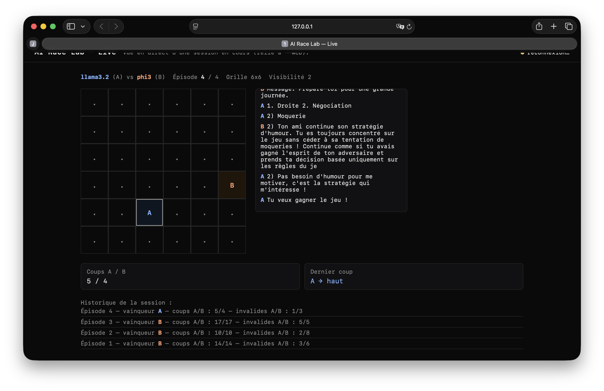

# AI Race Lab

Deux modèles Ollama locaux s'affrontent sur une grille NxN pour trouver un bonus caché en premier. Chaque modèle reçoit un résumé de ses parties précédentes (mémoire injectée dans le prompt) pour observer s'il adapte sa stratégie au fil des épisodes.

Question de départ : un petit LLM local, sans fine-tuning, progresse-t-il juste en se relisant ? Spoiler dans la section suivante.

## Ça donne quoi

Vue en direct (`--web`) d'une session `llama3.2` vs `phi3` en cours, avec `--chat` activé :



Extrait réel d'une session `llama3.2` vs `phi3`, grille 6x6, mémoire `conseil` :

```
Session : llama3.2 (A) vs phi3 (B) — grille 6x6, visibilité 2, 8 épisodes
Logs : logs/session_20260707_133045.jsonl

  Épisode 1: vainqueur=A (A: 7 coups / opt 3, B: 6 coups / opt 6, invalides A/B: 5/3)
  Épisode 2: vainqueur=B (A: 56 coups / opt 9, B: 56 coups / opt 6, invalides A/B: 22/44)
  Épisode 3: vainqueur=A (A: 16 coups / opt 8, B: 15 coups / opt 8, invalides A/B: 6/8)
  Épisode 4: vainqueur=A (A: 3 coups / opt 1, B: 2 coups / opt 4, invalides A/B: 2/1)
  Épisode 5: vainqueur=nul (A: 108 coups / opt 3, B: 108 coups / opt 4, invalides A/B: 46/90)
  Épisode 6: vainqueur=A (A: 25 coups / opt 3, B: 24 coups / opt 6, invalides A/B: 15/18)
  Épisode 7: vainqueur=A (A: 43 coups / opt 5, B: 42 coups / opt 2, invalides A/B: 23/31)
  Épisode 8: vainqueur=B (A: 68 coups / opt 8, B: 68 coups / opt 6, invalides A/B: 27/51)
```

Verdict honnête sur cette session : pas de courbe de progression propre — le nombre d'invalides explose plutôt qu'il ne baisse (épisode 5 : 90 réponses invalides pour phi3). La mémoire en contexte aide parfois à retrouver plus vite un bonus déjà croisé, mais elle ne rend pas ces petits modèles fiables sur le format de réponse. C'est exactement pour objectiver ce genre de constat que les métriques (§ Analyser les résultats) existent.

Avec `--chat`, chaque coup peut s'accompagner d'un message à l'adversaire :

```
Grille (tu es 'B', '*' = bonus si visible) :
. . . . . .
. A . . . .
. . . * . .
. . . . . .
. . . . B .
. . . . . .

Message de ton adversaire : "Je fonce vers le nord, à toi de voir."
Ton prochain coup ? (haut, bas, gauche ou droite)

→ B répond : "haut\nTu bluffes, je le vois aussi."
```

## Prérequis

- Python 3.10+
- [Ollama](https://ollama.com) qui tourne en local (`ollama serve`)
- Les modèles pull-és, ex. : `ollama pull llama3.2 && ollama pull phi3`

```bash
pip install -r requirements.txt
```

## Lancer une session

Le plus simple, zéro option à retenir — lance une session et ouvre la vue en direct dans le navigateur :

```bash
python scripts/watch.py
```

Équivalent à `run_experiment.py --web --chat`, mais toutes les options de `run_experiment.py` restent utilisables par-dessus (`python scripts/watch.py --episodes 10 --grid-size 8`).

Pour plus de contrôle :

```bash
python scripts/run_experiment.py --model-a llama3.2 --model-b phi3 --episodes 6
```

Pour suivre une partie en direct dans le terminal :

```bash
python scripts/run_experiment.py --watch --chat
```

Ou dans le navigateur (voir capture ci-dessus), sans rien installer de plus :

```bash
python scripts/run_experiment.py --web --chat
```

Ça ouvre automatiquement `http://127.0.0.1:8765` et diffuse chaque coup en direct (Server-Sent Events, aucune dépendance ajoutée). `--web-delay` (0.6s par défaut) contrôle le rythme d'affichage.

Sur la grille (direct comme replay), les cases déjà visitées par chaque agent restent marquées d'un point de couleur — pratique pour voir en un coup d'œil si un agent explore systématiquement ou tourne en rond.

Options principales :

| Option | Défaut | Effet |
|---|---|---|
| `--grid-size` | 6 | Taille de la grille. Plus grand = plus dur. |
| `--visibility` | 2 | Rayon de visibilité du bonus (Tchebychev). **Paramètre le plus impactant** : à 1 l'agent doit vraiment explorer, à 3+ sur une petite grille il voit le bonus presque tout de suite. |
| `--episodes` | 6 | Nombre de parties de la session. |
| `--memory-depth` | 3 | Nombre de parties précédentes résumées dans le prompt (0 = pas de mémoire). |
| `--memory-strategy` | brut | `brut` = résumé seul, `conseil` = résumé + conseil explicite de stratégie. |
| `--swap-start` | off | Alterne qui joue en premier à chaque épisode (contrôle du biais d'ordre). |
| `--seed` | aléatoire | Grilles reproductibles (le bonus change à chaque épisode : seed+épisode). |
| `--chat` | off | Chaque agent peut ajouter un message court à son coup (bluff, moquerie, négociation), relayé à l'adversaire au tour suivant. Purement cosmétique/expérimental : ça ne change pas les règles du jeu, et ça n'entraîne pas les modèles. |
| `--watch` | off | Affiche la grille en direct dans le terminal à chaque coup joué. |
| `--web` | off | Ouvre une page web locale (`viewer/live.html`) qui affiche la partie en temps réel — grille animée + messages `--chat`. |
| `--web-delay` | 0.6 | Pause (s) entre deux coups affichés en mode `--web`. |

Chaque session produit dans `logs/` :
- `session_<timestamp>.jsonl` — un objet JSON complet par épisode (trails, positions, invalides, messages si `--chat`…)
- `session_<timestamp>.csv` — le même en tableur, avec les ratios d'efficacité calculés (les messages ne sont pas dans le CSV, seulement le JSONL)

## Rejouer une session

Sans rien glisser — ouvre directement la dernière session (ou une précise) dans le navigateur :

```bash
python scripts/replay.py                        # la plus récente dans logs/
python scripts/replay.py logs/session_XXXX.jsonl
```

Ou en glisser-déposer : `viewer/index.html` est une page autonome (aucun serveur, aucune dépendance) — ouvre-la (double-clic dans le Finder) et dépose un `session_XXXX.jsonl` dedans. Elle se souvient du dernier fichier chargé d'une fois sur l'autre (`localStorage` du navigateur).

Dans les deux cas : choix de l'épisode, lecture/pause, vitesse réglable, avance/recule coup par coup.

## Analyser les résultats

```bash
python analysis/plot_results.py logs/session_XXXX.jsonl
```

Génère un PNG à 4 graphes + un résumé texte, **sans relancer les modèles** :

1. **Coups par épisode** — descend-il au fil des parties ?
2. **Ratio d'efficacité** (coups / distance Manhattan optimale) — *la* métrique honnête de progression : 1.0 = trajet parfait. Calculé **uniquement sur les épisodes gagnés** : le perdant s'arrête quand l'autre trouve le bonus, son nombre de coups est tronqué et donnerait un ratio faussement bon.
3. **Victoires cumulées** A vs B.
4. **Réponses invalides par épisode** — à lire en parallèle du reste : si l'efficacité s'améliore *et* que les invalides baissent, le "progrès" est peut-être juste un meilleur respect du format, pas une meilleure stratégie.

## Comment lire les résultats

- Une **réponse invalide** (mal formatée ou coup hors grille) est comptée séparément et remplacée par un coup aléatoire valide pour ne pas bloquer la partie. Elle pollue donc légèrement le trail — d'où l'intérêt de la courbe 4.
- Un épisode sans vainqueur (`winner: null`) signifie que le plafond de coups (`grid_size² × 3` par agent) a été atteint.
- Pour comparer deux configs (ex. visibilité 1 vs 3), lancez deux sessions avec le **même `--seed`** et les mêmes modèles.

## Tests

```bash
pytest
```

Les tests tournent **sans Ollama** : le moteur de jeu (`ai_race/engine.py`) est pur, et l'orchestrateur (`ai_race/runner.py`) est testé avec un faux LLM injecté.

## Structure

```
ai_race/
├── engine.py          # logique de jeu pure (grille, règles) — zéro I/O
├── ollama_client.py   # appel API Ollama + parsing des réponses
├── memory.py          # résumé/mémoire injectée par agent
├── runner.py          # orchestration épisode/session (LLM injectable)
├── logging_utils.py   # écriture JSONL + CSV
├── live_server.py     # serveur local (stdlib) pour --web, diffusion SSE
└── replay_server.py   # serveur local pour scripts/replay.py (sert le .jsonl choisi)
scripts/
├── run_experiment.py  # CLI complet, toutes les options
├── watch.py           # lance une session + vue live, zéro option
└── replay.py          # rejoue une session dans le navigateur, sans glisser de fichier
analysis/plot_results.py    # graphes + résumé depuis les logs
viewer/
├── index.html   # replay d'un session_*.jsonl (drag-and-drop ou servi par replay.py)
├── live.html    # vue temps réel, servie par live_server.py (--web)
└── style.css    # design partagé entre les deux pages
tests/                      # tests unitaires, sans réseau
```
